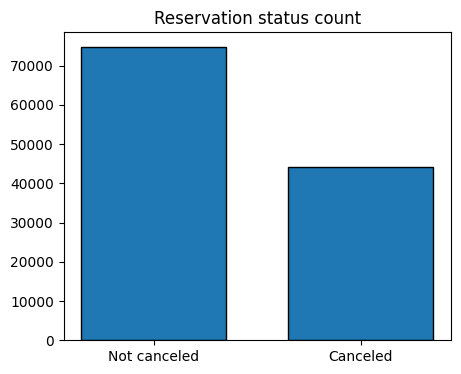
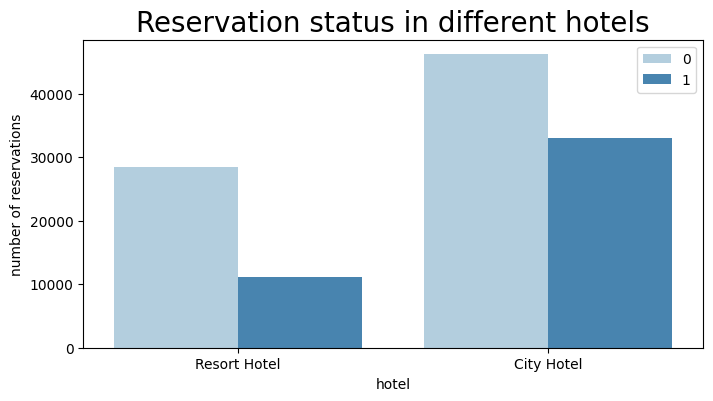
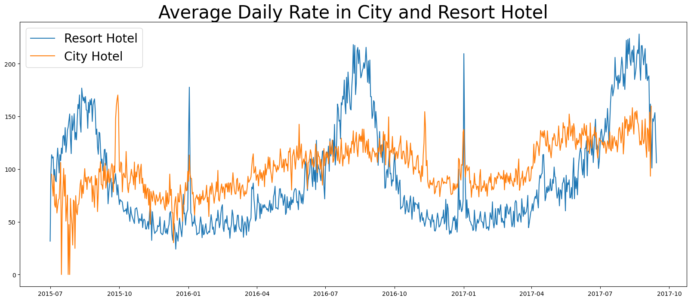
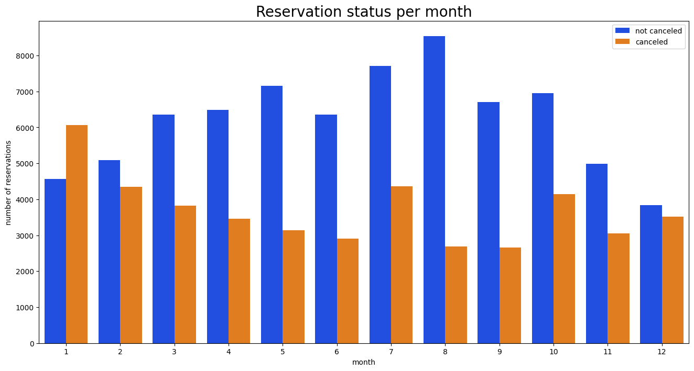
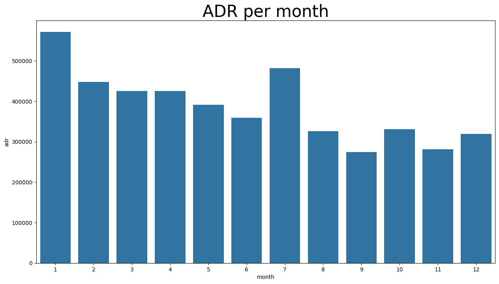
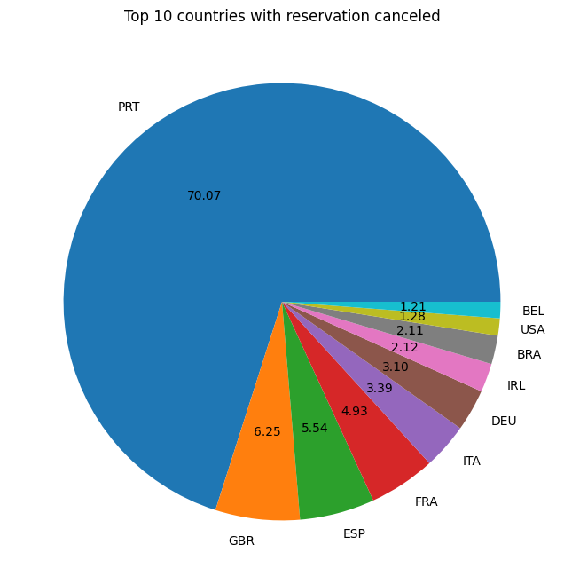
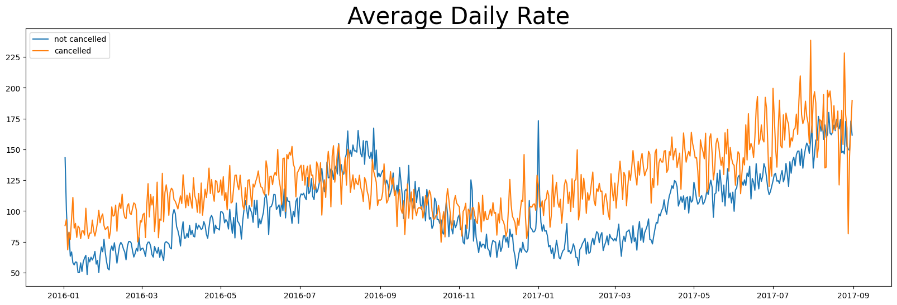

# Hotel Booking Analysis

## Business Problem
In recent years, both city hotels and resort hotels have experienced high cancellation rates. Each hotel is now facing several issues as a result, including:
- Reduced revenues
- Less than optimal room utilization

### Goal
To improve hotel efficiency and increase revenue, we aim to reduce cancellation rates in both hotels.

### Scope
The analysis of hotel booking cancellations as well as other factors that have no bearing on their business and yearly revenue generation are the main topics of this report.

## Assumptions
1. No unusual occurrences between 2015 and 2017 will have a substantial impact on the data used.
2. The information is still current and can be used to analyze a hotels’ possible plans in an efficient manner.
3. There are no unanticipated negatives to the hotel employing any advised technique.
4. The hotels are not currently using any of the suggested solutions.
5. The biggest factor affecting the effectiveness of earning income is booking cancellations.
6. Cancellations result in vacant rooms for the booked length of time.

## Research Questions
1. What are the variables that affect hotel reservation cancellations?
2. How can we reduce hotel reservation cancellations?
3. How will hotels be assisted in making price and promotional decisions?

## Hypothesis
1. More cancellations occur when prices are higher.
2. When there is no waiting list, customers tend to cancel more frequently.
3. The majority of clients are coming from offline travel agents to make their reservations.

## Analysis and Findings

### Cancellation Rates

The accompanying bar graph shows the percentage of the reservations that are cancelled and those that are not. It is obvious that there are still a significant number of reservations that have not been cancelled. There are still 37% of the clients who cancelled their reservation, which has a significant impact on the hotel’s earnings.

### Booking Comparison

In comparison to resort hotels, city hotels have more bookings. It’s possible that resort hotels are more expensive than those in cities.

### Average Daily Rate

The line graph above shows that, on certain days, the average daily rate for the city hotel is less than that of a resort hotel, and on other days, it is even less. It goes without saying that weekends and holidays may see a rise in resort hotel rates.

### Monthly Reservation Levels
We have developed a grouped bar graph to analyze the months with the highest and lowest reservation levels according to reservation status. As can be seen, the number of confirmed reservations is largest and the number of cancelled reservations is smallest in the month of August, whereas January is the month where most cancellations take place.

### Price Impact on Cancellations

This bar graph demonstrates that cancellations are most common when prices are greater and are least common when prices are lowest. Therefore, the cost of the accommodation is solely responsible for the cancellations.

### Country-wise Cancellations
Portugal has the highest number of cancellations.

### Booking Channels
Around 46% of the clients come from online travel agencies, whereas 27% come from groups. Only 4% of the clients book hotels directly by visiting them and making reservations.

### Average Daily Rate and Cancellations

As seen in the graph, reservations are cancelled when the average daily rate is higher than when it is not cancelled. This clearly proves all the above analyses, that higher prices lead to higher cancellations.

## Suggestions
1. **Price Strategy**: Cancellation rates rise as the price does. To prevent cancellations, hotels could work on their price strategies and try to lower the rates for specific hotels based on locations. They can also provide some discounts to the customers.
2. **Weekend Discounts**: The ratio of cancellations to non-cancellations of resort hotels is higher than city hotels. So, the hotels should provide reasonable discounts on room prices on weekends or holidays.
3. **Online Presence**: As the majority of cancellations are made on online bookings, customers might not be satisfied with the services they saw online. Thus, hotels should improve their online galleries and work on the services they provide.
4. **January Campaign**: In January, hotels can start a campaign or marketing with a reasonable amount to increase their revenue as the cancellation rate is highest in this month.
5. **Focus on Portugal**: They can also increase the quantity of their hotels and their services mainly in Portugal to reduce the cancellation rates.

---

Feel free to copy and paste this Markdown content to create a beautiful README for your GitHub repository.
